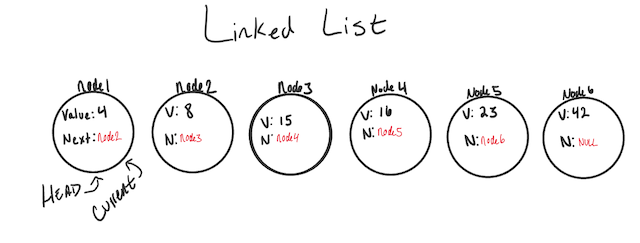

# Linked Lists

## Big O: Analysis of Algorithm Efficiency

Big O is described for the efficiency it produce through its algorithm or functions. Big O efficiency is gauged based on 2 main factors: 

1. **Time**: the time it takes a function to complete
2. **Space**: the memory required for a function to store data and instructions

**Big** O has 4 key areas for analysis:

1. Input Size
2. Units of Measurement
3. Orders of Growth
4. Best Case, Worst Case, and Average Case

- Input size refers to the totality of an parameter values that are read by the algorithm, however, takes the totality of each parameter value as well.

- Unit Measurement focus on function for Time and Space complexity.

- Order Growth represents increase in Running Time or Memory Space.

Reference:

[Big O: Analysis of Algorithm Efficieny, Code Fellows](https://codefellows.github.io/common_curriculum/data_structures_and_algorithms/Code_401/class-05/resources/big_oh.html)

## What is a linked list

A data structure that contains nodes that links/points to the next node in the list. 

It's a sequence of nodes connected/linked to each other. 

Each Node in a linked list reference to the next node in the link.

**There are two types of Linked List**:

1. Singly: A singly linked list has one reference point that points to the next node in the linked list.

i.e diagram of a sinlgy linked list:

2. Doubly: A doubly linked list is a reference to both Next and Pervious node.

**Traversal**

- A traversal linked list will not work properly if a **foreach** or **for** loop is used.

- The best way to approach a traversal is through the use of a **while()** loop.

Reference link:

[Linked Lists, Code Fellows](https://codefellows.github.io/common_curriculum/data_structures_and_algorithms/Code_401/class-05/resources/singly_linked_list.html)

[What is a Linked List, Anyway? Part 1, Vaidehi Joshi](https://medium.com/basecs/whats-a-linked-list-anyway-part-1-d8b7e6508b9d)

[What's a Linked List, Anyway? Part 2, Vaidehi Joshi](https://medium.com/basecs/whats-a-linked-list-anyway-part-2-131d96f71996)

