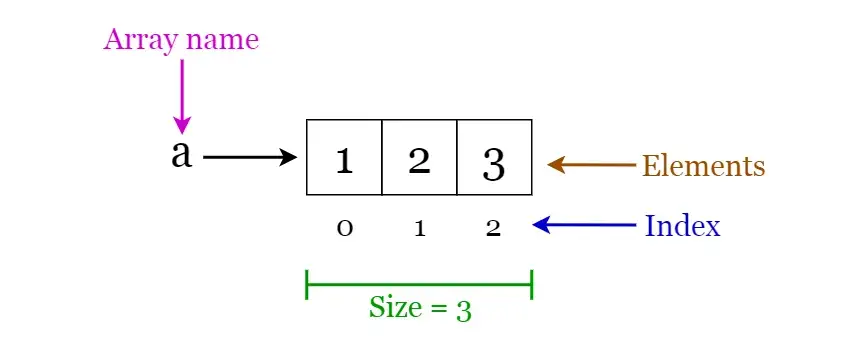
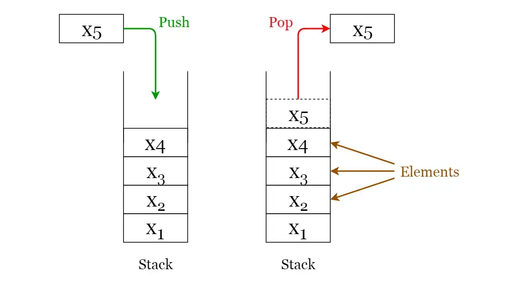
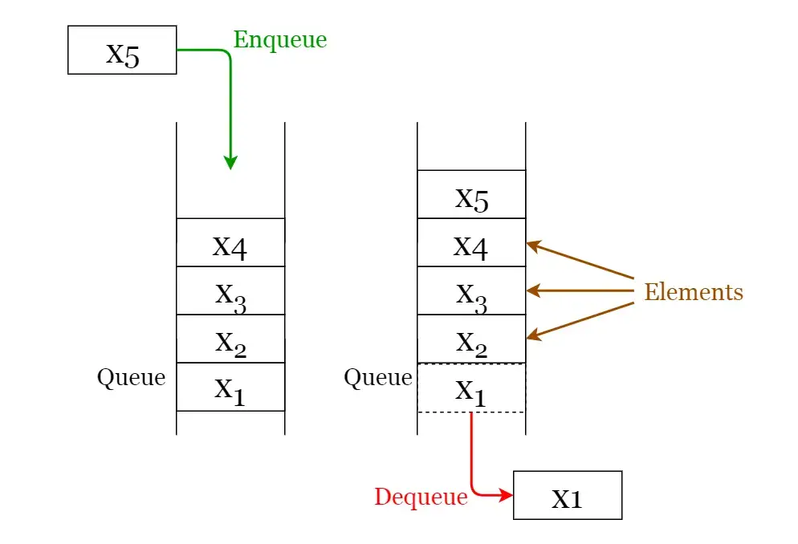
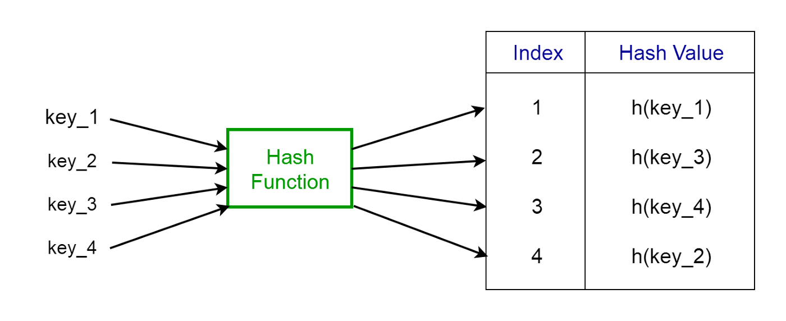
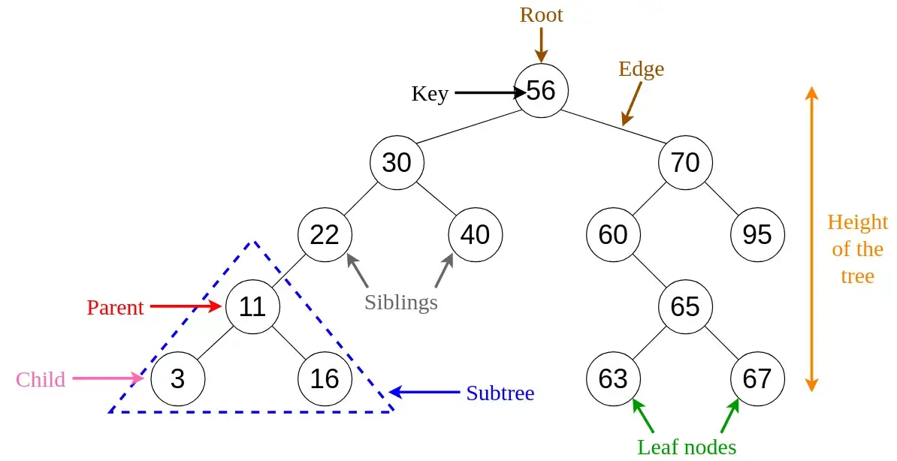

# Data Structures and Algorithms

[Basic Recurison](https://www.youtube.com/watch?v=vPEJSJMg4jY)

[Data Structures in 15 Minutes](https://www.youtube.com/watch?v=sVxBVvlnJsM)

[Big O Explained](https://www.youtube.com/watch?v=v4cd1O4zkGw)

## Basic Data Structures

*8 Common Data Structures every Programmer must know*

Data Structures are a specialized means of organizing and storing data in computers in such a way that we can perform operations on the stored data more efficiently. Data structures have a wide and diverse scope of usage across the fields of Computer Science and Software Engineering.

1. Arrays
An array is a structure of fixed-size, which can hold items of the same data type. It can be an array of integers, an array of floating-point numbers, an array of strings or even an array of arrays (such as 2-dimensional arrays). Arrays are indexed, meaning that random access is possible.

Array operations
- Traverse: Go through the elements and print them.
- Search: Search for an element in the array. You can search the element by its value or its index
- Update: Update the value of an existing element at a given index

2. Linked Lists
A linked list is a sequential structure that consists of a sequence of items in linear order which are linked to each other. Hence, you have to access data sequentially and random access is not possible. Linked lists provide a simple and flexible representation of dynamic sets.

Let’s consider the following terms regarding linked lists. You can get a clear idea by referring to Figure 2.

- Elements in a linked list are known as nodes.
- Each node contains a key and a pointer to its successor node, known as next.
- The attribute named head points to the first element of the linked list.
- The last element of the linked list is known as the tail.

3. Stacks
A stack is a LIFO (Last In First Out — the element placed at last can be accessed at first) structure which can be commonly found in many programming languages. This structure is named as “stack” because it resembles a real-world stack — a stack of plates.

Stack operations
Given below are the 2 basic operations that can be performed on a stack. Please refer to Figure 3 to get a better understanding of the stack operations.

- Push: Insert an element on to the top of the stack.
- Pop: Delete the topmost element and return it.

4. Queues
A queue is a FIFO (First In First Out — the element placed at first can be accessed at first) structure which can be commonly found in many programming languages. This structure is named as “queue” because it resembles a real-world queue — people waiting in a queue.

Queue operations
Given below are the 2 basic operations that can be performed on a queue. Please refer to Figure 4 to get a better understanding of the queue operations.

- Enqueue: Insert an element to the end of the queue.
- Dequeue: Delete the element from the beginning of the queue.

5. Hash Tables
A Hash Table is a data structure that stores values which have keys associated with each of them. Furthermore, it supports lookup efficiently if we know the key associated with the value. Hence it is very efficient in inserting and searching, irrespective of the size of the data.

Hash Function
A special function named as the hash function (h) is used to overcome the aforementioned problem in direct addressing.

h(k) = k % m

- h: Hash function
- k: Key of which the hash value should be determined
- m: Size of the hash table (number of slots available). A prime value that is not close to an exact power of 2 is a good choice for m.

6. Trees
A tree is a hierarchical structure where data is organized hierarchically and are linked together. This structure is different from a linked list whereas, in a linked list, items are linked in a linear order.

Binary Search Trees
A binary search tree (BST), as the name suggests, is a binary tree where data is organized in a hierarchical structure. This data structure stores values in sorted order.

Every node in a binary search tree comprises the following attributes.

1. key: The value stored in the node.
2. left: The pointer to the left child.
3. right: The pointer to the right child.
4. p: The pointer to the parent node.

A binary search tree exhibits a unique property that distinguishes it from other trees. This property is known as the binary-search-tree property.

Let x be a node in a binary search tree.

- If y is a node in the left subtree of x, then y.key ≤ x.key
- If y is a node in the right subtree of x, then y.key ≥ x.key

### Applications of trees

- Binary Trees: Used to implement expression parsers and expression solvers.
- Binary Search Tree: used in many search applications where data are constantly entering and leaving.
- Heaps: used by JVM (Java Virtual Machine) to store Java objects.
- Treaps: used in wireless networking.

7. Heaps

A **Heap** is a special case of a binary tree where the parent nodes are compared to their children with their values and are arranged accordingly.

Let us see how we can represent heaps. Heaps can be represented using trees as well as arrays. Figures 7 and 8 show how we can represent a binary heap using a binary tree and an array.

8. Graphs

A graph consists of a finite set of vertices or nodes and a set of edges connecting these vertices.

The order of a graph is the number of vertices in the graph. The size of a graph is the number of edges in the graph.

Two nodes are said to be adjacent if they are connected to each other by the same edge.

Directed Graphs

A graph G is said to be a directed graph if all its edges have a direction indicating what is the start vertex and what is the end vertex.

We say that (u, v) is incident from or leaves vertex u and is incident to or enters vertex v.

Self-loops: Edges from a vertex to itself.

Undirected Graphs

A graph G is said to be an undirected graph if all its edges have no direction. It can go in both ways between the two vertices.

If a vertex is not connected to any other node in the graph, it is said to be isolated.

Applications of graphs

- Used to represent social media networks. Each user is a vertex, and when users connect they create an edge.
- Used to represent web pages and links by search engines. Web pages on the internet are linked to each other by hyperlinks. Each page is a vertex and the hyperlink between two pages is an edge. Used for Page Ranking in Google.
- Used to represent locations and routes in GPS. Locations are vertices and the routes connecting locations are edges. Used to calculate the shortest route between two locations.